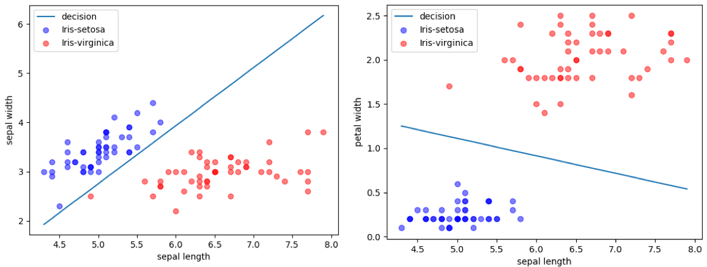
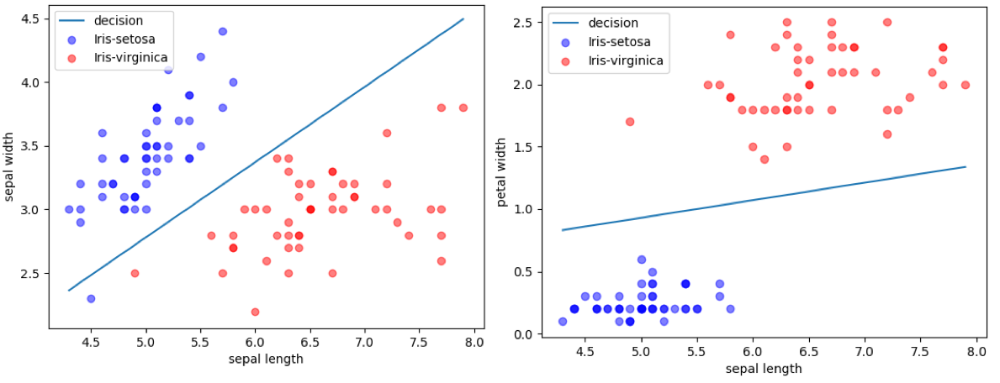
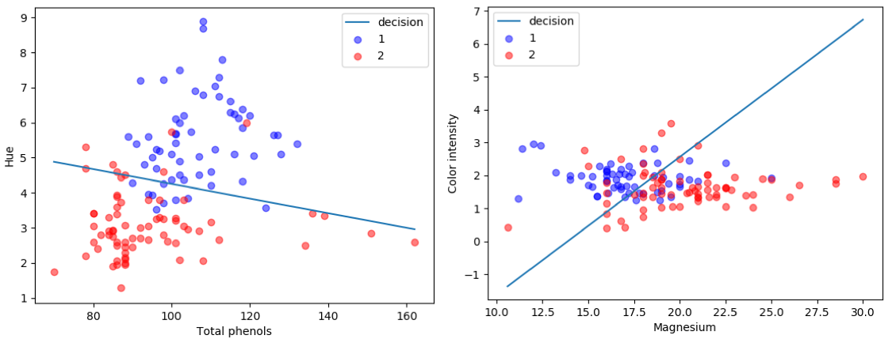
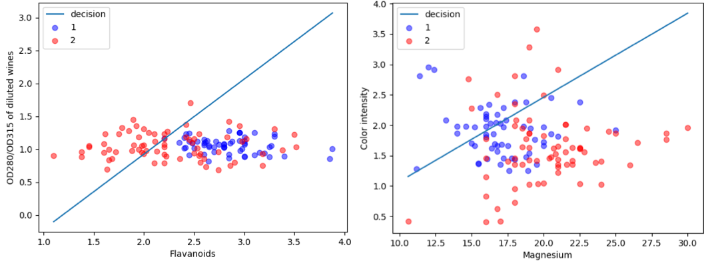

# Assignment 1

> Use Logistic Regression Classification in iris and wine data set. Train the model with Newton Method and Gradient Descent.


### 1. Introduction

Use iris and wine two data set, and select 2 classes and 2 features of data as training data set. And the Logistic Regression Classification model is used to solve the two classification problem.


### 2. How to Run

#### 2.1 Environments

`python` > 3.5

#### 2.2 Dependencies

```shell
# install dependencies
$ pip install -r requirements.txt
```

#### 2.3 Running

```shell
# Use Newton Method, and iris data set selected the first and second features and 2 classes including Iris-setosa and Iris-virginica.
$ python train.py --optimizer=newton --data_type=iris --feature_0=0 --feature_1=1 --label_0=Iris-setosa --label_1=Iris-virginica

# Use Gradient Descent, and wine data set selected the fifth and tenth features and 2 classes including wine 1 and wine 2.
$ python train.py --optimizer=gradient_descent --data_type=wine --feature_0=5 --feature_1=10 --label_0=1 --label_1=2
```


### 3. Project Structure

The project contains 5 python files, a staitic folders and a requirements.txt as follows:

#### 3.1 requirements.txt

Store the thrid party packages using in project, which is generated by the shell command `pip freeze > requirements.txt`.

#### 3.2 static/

- `static/input` stores the input data set.


- `static/output` stores the output images and logs.
  - `static/output/iris` stores the train result of iris data set.
  - `static/output/wine` stores the wine results of wine data set.

#### 3.3 utils/shell_utils

The constant value `SHELL_ARGS` stores the arguments reading from shell command.

| Name      | Description                                                  | Type                                                         |
| --------- | ------------------------------------------------------------ | ------------------------------------------------------------ |
| optimizer | The agument whether using Newton Method or Gradient Descent to train model. | str, 'newton' or 'gradient_descent'.                         |
| data_type | The argument to decide using which data set.                 | str, 'iris' or 'wine'.                                       |
| feature_0 | The first feature index.                                     | int, [0, 3] for iris, [1, 13] for wine.                      |
| feature_1 | The second feature index.                                    | int, [0, 3] for iris, [1, 13] for wine.                      |
| label_0   | The first label name.                                        | str, ['Iris-versicolor', 'Iris-setosa', 'Iris-virginica'] for iris, ['1', '2', '3'] for wine. |
| label_1   | The second label name.                                       | str, ['Iris-versicolor', 'Iris-setosa', 'Iris-virginica'] for iris, ['1', '2', '3'] for wine. |

#### 3.4 constants.py

Store constant value using in project including the following things:

- The absolute path of static directories and fiels.
- The hyper parameters of model.

#### 3.5 data.py

The class `Data` encapsulates opeartions including reading and querying from data set.

- Read data set from csv file, and only remain 2 calsses of label and 2 features. The variable `source_data` stores source data and `target_data` stores target data.
  - Type of source_data is 2-d vector. Each row contains 2 features.
  - Type of target_data is 2-d vector. Each row contains 1 label(0 or 1).
- `min_bound`和`max_bound` store the boundary of source_data.

#### 3.6 model.py

Implement Logistic Regression Classification with `python` and `numpy`.

Store the parameter `weights` and `bias`, which are updated at training and used at predicting.

The method `optimize` will optimize the parameter with optimize algorithm according to `source_data` and `target_data`. The optimize algorithm will be selected Newton Method or Gradient Descent according to the shell argument `SHELL_ARGS.optimizer`.

Because the data set has n rows of data, we need these n rows of data to compute kinds of value, when we compute first gradient and second gradient. In this process, we don't need `for` loop in python to compute it, but use the huge matrix to compute. For example, we compute first gradient by the following ways:

```python
# [n, 3]
gradient1_matrix = source_data * np.reshape((target_data - predicted_data), (-1, 1))
# [3]
gradient1 = np.sum(gradient1_matrix, axis=0)
```

In this way, we can compute more efficiently. For the reason,  the process of matrix calculation optimizes a lot of computationes. And the bottom layer of the matrix operation for `numpy` uses `C++` for calculation, which is significantly fater than the loop in `python`.

#### 3.5 train.py

The entrance of project.

- Read data from data set
- Use Logistic Regression Classification model to Iterative train.
- Stop train when the second norm of first gradient is lower than 1e-6.
- Early stop
  - For Newton Method, because there are some conditions with no convergence, if the loss value rises more than 5 times, then early stop.
  - For Gradient Descent, make iterations up to 50 times.
- After finishing traing, store the decision plot, the plot about iteration and loss, and the logs including loss, accuracy and weights with iterations, 


### 4. Expirement Result and Analysis

#### 4.1 Convergence of loss


The experimental training set uses the iris and wine data sets respectively, and only retains 2 features and 2 categories of data at a time for training. At the beginning of the training, the initial value of all parameters of the model is 0.0. And for the Gradient Descent algorithm, the learning rate is 0.02. Training is performed  respectively using the Newton method and the gradient descent algorithm.

For the **Iris** dataset, the categories Iris-setosa and Iris-virginica are selected. For the four features including sepal length, sepal width, petal length and petal width, every two different features are combined to obtain six different data sets for training. 

The feature points and decision line of the Newton Method and the Gradient Descent algorithm are shown in Fig. 1 and Fig. 2. The red points are in the Iris-virginica category, and the blue points are in the Iris-setosa category. And the line is the two-class decision, which is a boundary line with data points of different categories on either side.

- For the Newton Method, the loss of trainning result is lower than `1e-6`,  and the accuracy is 1.0.
- For the Gradient Descent, the loss is lower than `1e-3`, and the accuracy is approximately bigger thean 0.95.

For the **wine** dataset, two categories 1 and 2 are selected. For the 13 features, the 5th and 10th feature, the 4th and 9th features are selected. The feature points and decision line of the Newton Method and the Gradient Descent algorithm are shown in Figures 3 and 4.

- For the Newton Method, the loss is between 0.2 and 0.5, and the accuracy is between 0.75 and 0.8.
- For the Gradient Descent, the loss is between 2.0 and 5.0, and the accuarcy is between 0.5 and 0.75.

We can get the following information from the loss and accuracy and  the plot with feature points and decision line :

- The Logistics Regression Classification model trained by Newton Method can more accurately distinguish two categories of datasets based on two features. The result loss and accuracy are relatively high. Even for the wine dataset, it cannot use two features to distinguish the two categories well, but the final accuracy of the Newton Method is around 0.8.
- The Gradient Descent algorithm can also distinguish between two categories on the data set. However, the accuracy is reduced relative to the Newton method. For example, the first plot on the iris data set in Figure 2. As well as the wine dataset, the accuracy of the Gradient Descent is only around 0.5.



​			 					Fig.1 iris-Newton Method-Feature point and decision line



​						Fig.2 iris-Gradient Descent-Feature point and decision line



​			 					Fig.3 wine-Newton Method-Feature point and decision line



​						Fig.4 wine-Gradient Descent-Feature point and decision line


For the speed of convergence, the Newton Method can converge as long as 10 times, and the Gradient Descent algorithm converges slowly. It needs about 50 times to converge on the iris data set and more than 100 times on the wine data set. When the data set is iris and the two features are sepal width and sepal length, the curves of the loss value with the number of iterations using the Newton Method and the Fradient Descent algorithm are shown in Fig. 5.

- When we use the Newton Method to optimize the parameters, the loss value drops extremely fast, and after about 5 iterations, the loss value approaches 0.

- While with the gradient descent algorithm, the loss drops very slowly. After about 50 iterations, the loss value converges to around 0, and the final convergence value is slightly larger than the Newton Method convergence value. And during the training process, the loss value may oscillate.


​                                   Fig.5 The curves of epoch-loss when features is sepal width and sepal length.

#### 4.2 Some cases of Newton Method cannot converge
In the training process, it is also found that the Newton Method cannot get the convergence result sometimes when taking different initial values, and the Gradient Descent algorithm will converge to near 0 although the loss value decreases slowly. On the one hand the loss value is trapped near a certain value and cannot be continued to decrease. On the other hand the inverse of the matrix cannot be calculated sometimes. So there are two reasons why it can't converge:

1. Using the Newton Method may cause the loss value to be trapped at other values and cannot be updated.

2. The inverse of the Hessian matrix is calculated during the update process, but the inverse of the matrix may not exist for some matrix, which means that Newton direction may not exist.

#### 4.3 Conclusion

In summary, the Newton Method has the following advantages and disadvantages compared to the gradient descent algorithm:

- Advantages
  - When using the Newton Method to optimize the logistic regression classification model, the loss value drops quickly, and a very accurate model can be obtained after several iterations.
  - While when using the gradient descent algorithm, the loss value decreases relatively slowly, and finally oscillates around the minimum value. And the converged loss value is not as accurate as the Newton method.
- Disadvantages
  - Using the Newton Method may cause the loss value to be trapped at other values and cannot continue to be updated.
  - The inverse of the Hessian matrix is calculated during the update process, but the inverse of the matrix may not exist for some matrix, which means that Newton direction may not exist.
  - Since the inverse matrix of the second gradient is calculated, when there are large amounts of features, which means the dimension is relatively high, it cost a lot of time to calculate the inverse matrix. The Gradient Descent algorithm only needs to calculate the first gradien, so the speed will be much faster when there are many features.

In addition, when using the Logistic Regression Classification model for the two-classification problem, it is difficult to achieve an accuracy of 0.9 for the wine dataset with two features. Because when the wine dataset is drawn on a plane cartesian coordinate system, many feature points of different classes overlap.

It can be abstracted into data as shown in the Fig.6, where red and blue are points of two categories respectively. Because the parameters of the logistic regression classification model are equivalent to a decision line on the plane, the different sides of the line are different categories. However, in this example, it is not possible to divide the data to the two categories by a straight line. Therefore, some problems of the two-classifications cannot be solved by using the logistic regression classification model of this paper.


​										Fig.6 The special example