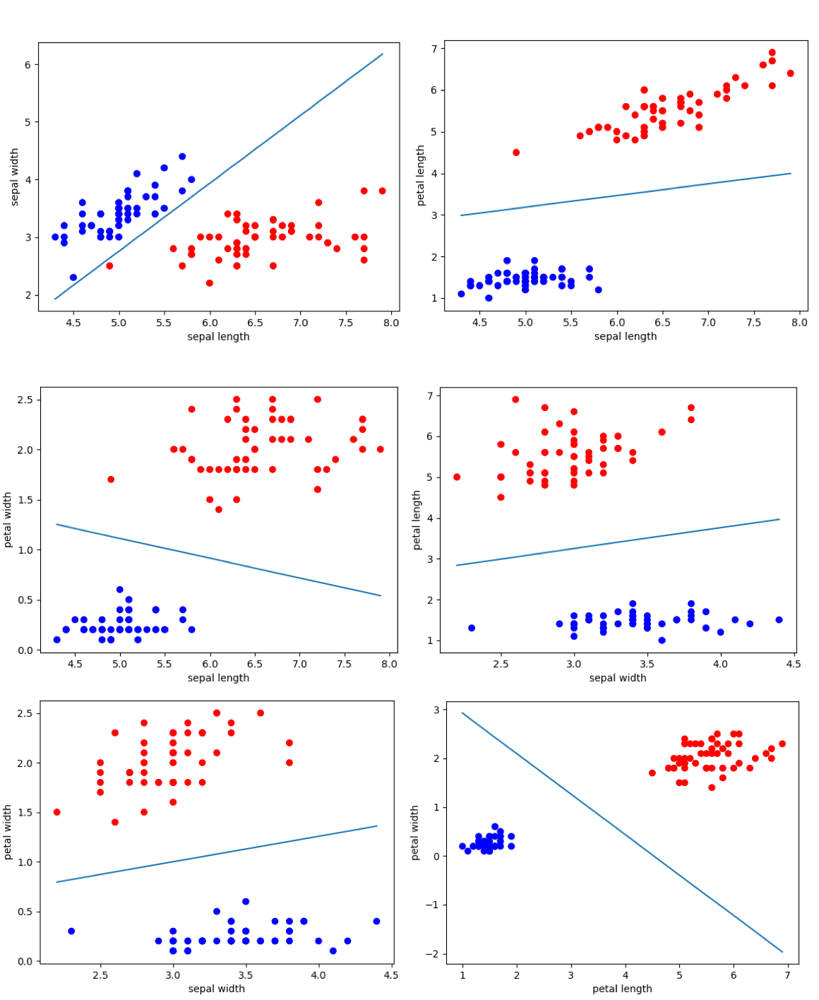
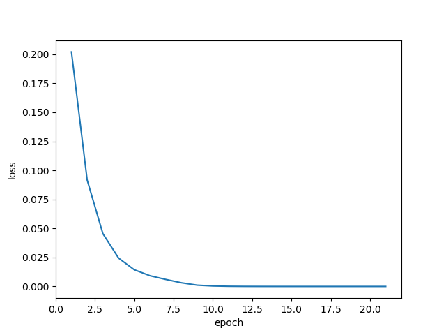
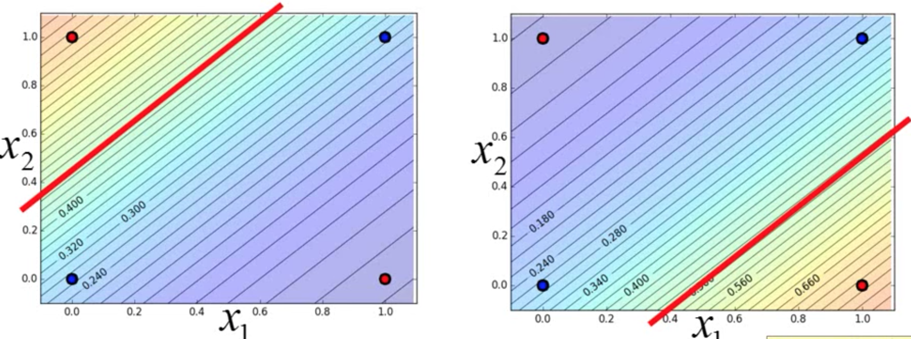

# Assignment 1

> 在Iris数据集上使用Logistic Regression来解决二分类问题。


### 1. 概述

使用Iris数据集，选取2个特征值、2个类别的数据来作为训练的数据集，利用Logistic Regression模型来解决二分类问题。


### 2. 运行

#### 2.1 运行环境

`python` > 3.5

#### 2.2 安装依赖

```shell
$ pip install -r requirements
```

#### 2.3 运行

```shell
$ python train.py
```


### 3. 代码结构

项目中共有4个python文件、1个static文件夹、一个requirements.txt文件，具体如下：

#### 3.1 requirements.txt

由命令`pip freeze > requirements.txt`生成，存储项目中用到的第三方包。

#### 3.2 static/

- `static/input`存储输入的数据集。


- `static/output`存储输出的图片和值。

#### 3.3 constants.py

存储项目中用到的常量，包括：

- 各类静态文件夹和文件的绝对路径。
- 选取数据集中的哪些特征值和类别。
- 以及模型中的超参数。

#### 3.4 data.py

类`Data`，对数据集的读取和查询进行封装.

- 从csv文件中读取数据集，只保留2个特征值、2个类别的数据，分别存在变量`source_data`和`target_data`中。
- 存储source_data的边界`min_bound`和`max_bound`。

#### 3.4 model.py

使用`python`和`numpy`实现Logistic Regression模型。

存储参数`weights`和`bias`，便于训练的时候对参数进行更新，以及预测结果时使用参数。

方法`optimize`，会根据输入的`source_data`和`target_data`，利用牛顿法，对参数进行优化。

由于数据集有n条数据，在计算一阶偏导和二阶偏导时，需要使用这n条数据的各种值进行运算。在这个过程中，不使用python中的for循环来计算，而是使用大的矩阵来进行运算。。例如使用如下的方式来计算一阶偏导：

```python
# [n, 3]
gradient1_matrix = source_data * np.reshape((target_data - predicted_data), (-1, 1))
# [3]
gradient1 = np.sum(gradient1_matrix, axis=0)
```

这样可以更高效率的完成计算，因为矩阵运算过程中优化了很多计算的过程，并且`numpy`的矩阵运算底层使用了`C++`来进行计算，比在`python`中使用for循环会快很多。

#### 3.5 train.py

项目的入口。

- 从数据集中读取数据，利用Logistic Regression模型进行迭代训练。
- 直到模型输出的一阶偏导矩阵的二阶范数小于一个特定的值，停止训练。
- 因为存在无法收敛的情况，如果loss值上升了5次以上，则early stop。
- 停止训练后，存储最后一次迭代的损失值和一阶偏导矩阵的二阶范数，以及数据集和参数`weights`的可视化图片。


### 4. 实验结果及分析

#### 4.1 loss值迅速收敛

实验的训练集使用了Iris数据集，并且每次只保留2个特征值和2个类别的数据来进行训练。具体选取了Iris-setosa_Iris和virginica两个类别，对于4个特征值sepal length、sepal width、petal length、petal width，分别两两组合，得到6个不同的数据集来进行训练。在训练开始时，模型所有的参数的初始值为0.0。实验结果的实验数据集三点及参数直线示意图如图1所示，可以看到经过牛顿法训练的Logistics Regression模型，可以根据两个特征值很好的区分开了Iris数据集的两个类别。



​			 					图1 实验数据集三点及参数直线示意图

此外，从实验过程中loss值在每次迭代的变化情况可以看出，使用牛顿法来优化参数，loss值下降得特别快，经过10次迭代以内loss值就趋近于0了。其中在两个特征值为sepal width和sepal length时的loss值随迭代次数的曲线如图2所示。



​                                   图2 特征值为sepal width和sepal length时的随迭代次数-loss值曲线

#### 4.2 部分情况无法收敛

但是在训练过程中 也发现，在取不同的初始值的时候，可能得不到收敛的结果。一种出现的状况是loss值陷在某一个值附近，无法继续减小，另外一种是出现无法计算矩阵的逆的情况。所以会有2个原因会导致无法收敛：

1. 使用牛顿法可能使损失值陷在其他极小值位置无法继续更新。
2. 因为更新过程中，计算了海森矩阵的逆，但是矩阵的逆并不一定存在，也就是说牛顿发现可能是不在的。

#### 4.3 总结

因此牛顿法具有如下的优缺点：

- 优点
  - 使用牛顿法来优化逻辑回归模型，loss值下降很快，可以经过几次迭代就得到很精确的解。
- 缺点
  - 使用牛顿法可能使损失值陷在其他极小值位置无法继续更新。
  - 因为更新过程中，计算了海森矩阵的逆，但是矩阵的逆并不一定存在，也就是说牛顿方向可能是不在的。
  - 因为计算了二阶偏导的逆矩阵，当特征值比较多，即维度比较高的时候，计算这个逆矩阵很耗时。

此外使用逻辑回归的模型进行二分类问题时，可能会出现如下图的数据，其中红色和蓝色分别为两个类别的点。因为逻辑回归模型的参数相当于平面上的一条直线，直线上下是不同的类别。但是这个例子中，无法用一条直线去把两个类别的数据分别划分在这条直线的两侧。因此有些数据集的二分类的问题，无法使用本文的逻辑回归模型来进行计算。



​										图3 特殊的数据例子