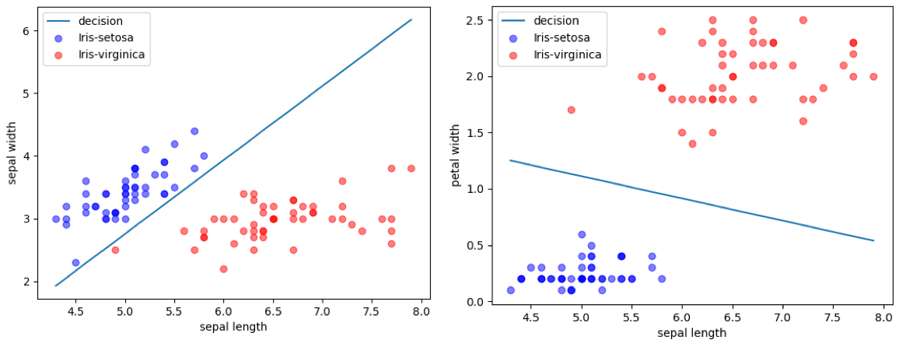
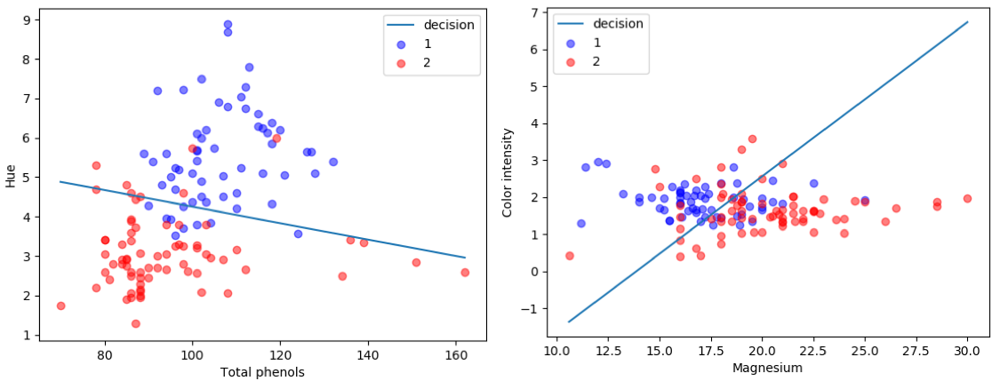

# Assignment 1

> 在Iris和wine两个数据集上使用Logistic Regression，分别使用牛顿法和梯度下降两个优化算法来训练模型。


### 1. 概述

使用Iris和wine两个数据集，选取2个特征值、2个类别的数据来作为训练的数据集，利用Logistic Regression模型来解决二分类问题。


### 2. 运行

#### 2.1 运行环境

`python` > 3.5

#### 2.2 安装依赖

```shell
$ pip install -r requirements.txt
```

#### 2.3 运行

```shell
# 使用牛顿法，使用iris数据集，特征值选取第1个和第2个，两个类别为Iris-setosa和Iris-virginica
$ python train.py --optimizer=newton --data_type=iris --feature_0=0 --feature_1=1 --label_0=Iris-setosa --label_1=Iris-virginica

# 使用梯度下降算法，使用wine数据集，特征值选取第5个和第10个，两个类别为1和2
$ python train.py --optimizer=newton --data_type=wine --feature_0=5 --feature_1=10 --label_0=1 --label_1=2
```


### 3. 代码结构

项目中共有5个python文件、1个static文件夹、一个requirements.txt文件，具体如下：

#### 3.1 requirements.txt

由命令`pip freeze > requirements.txt`生成，存储项目中用到的第三方包。

#### 3.2 static/

- `static/input`存储输入的数据集。


- `static/output`存储输出的图片和值。
  - `static/output/iris`为iris数据集的训练结果。
  - `static/output/wine`为wine数据集的训练结果。

#### 3.3 utils/shell_utils

常量`SHELL_ARGS`存储了从命令行读取的参数，具体如下。

| 名称      | 描述                                   | 类型                                                         |
| --------- | -------------------------------------- | ------------------------------------------------------------ |
| optimizer | 使用牛顿法还是梯度下降来优化模型的参数 | newton或gradient_descent                                     |
| data_type | 使用哪个数据集                         | iris或wine                                                   |
| feature_0 | 从Iris或wine数据集中选取的第一个特征值 | int，对于iris[0, 3]，对于wine[1, 13]                         |
| feature_1 | 从Iris或wine数据集中选取的第二个特征值 | int，对于iris[0, 3]，对于wine[1, 13]                         |
| label_0   | 从Iris或wine数据集中选取的第一个类别   | str，对于iris['Iris-versicolor', 'Iris-setosa', 'Iris-virginica']，对于wine['1', '2', '3'] |
| label_1   | 从Iris或wine数据集中选取的第二个类别   | str，对于iris['Iris-versicolor', 'Iris-setosa', 'Iris-virginica']，对于wine['1', '2', '3'] |

#### 3.4 constants.py

存储项目中用到的常量，包括：

- 各类静态文件夹和文件的绝对路径。
- 选取数据集中的哪些类别。
- 以及模型中的超参数。

#### 3.5 data.py

类`Data`，对数据集的读取和查询进行封装.

- 从csv文件中读取数据集，只保留2个特征值、2个类别的数据，分别存在变量`source_data`和`target_data`中。
  - source_data是二维数组，每一行存储了2个特征值。
  - target_data是一位数组，每个元素是0或者1（如果类别是Iris-setosa则是0，是Iris-virginica则是1）
- 存储source_data的边界`min_bound`和`max_bound`。

#### 3.6 model.py

使用`python`和`numpy`实现Logistic Regression模型。

存储参数`weights`和`bias`，便于训练的时候对参数进行更新，以及预测结果时使用参数。

方法`optimize`，会根据输入的`source_data`和`target_data`，利用优化算法对参数进行优化。具体的优化算法会根据命令行参数`SHELL_ARGS.optimizer`使用牛顿法或梯度下降算法。

由于数据集有n条数据，在计算一阶偏导和二阶偏导时，需要使用这n条数据的各种值进行运算。在这个过程中，不使用python中的for循环来计算，而是使用大的矩阵来进行运算。。例如使用如下的方式来计算一阶偏导：

```python
# [n, 3]
gradient1_matrix = source_data * np.reshape((target_data - predicted_data), (-1, 1))
# [3]
gradient1 = np.sum(gradient1_matrix, axis=0)
```

这样可以更高效率的完成计算，因为矩阵运算过程中优化了很多计算的过程，并且`numpy`的矩阵运算底层使用了`C++`来进行计算，比在`python`中使用for循环会快很多。

#### 3.5 train.py

项目的入口。

- 从数据集中读取数据，利用Logistic Regression模型进行迭代训练。
- 直到模型输出的一阶偏导矩阵的二阶范数小于一个特定的值，停止训练。
- early stop
  - 对于牛顿法，因为存在无法收敛的情况，如果loss值上升了5次以上，则early stop。
  - 对于梯度下降算法，最多迭代50次，超过50次则停止
- 停止训练后，存储最后一次迭代的损失值和一阶偏导矩阵的二阶范数、数据集和参数`weights`的可视化图片、以及迭代次数-loss值曲线。


### 4. 实验结果及分析

#### 4.1 loss值收敛情况

实验的训练集分别使用了Iris和wine数据集，并且每次只保留2个特征值和2个类别的数据来进行训练。在训练开始时，模型所有的参数的初始值为0.0，对于梯度下降算法，学习率为0.02。分别使用牛顿法和梯度下降算法来进行训练。

对于**Iris数据集**，具体选取了Iris-setosa_Iris和virginica两个类别，对于4个特征值sepal length、sepal width、petal length、petal width，分别两两组合，得到6个不同的数据集来进行训练。牛顿法和梯度下降算法的特征值点和决策线示意图如图1和图2所示，其中红色的点为Iris-virginica类别的，蓝色的点为Iris-setosa类别，直线为二分类决策的边界线，它的两侧为不同类别的数据点。

- 对于牛顿法，训练结果的损失值小于`1e-6`，精确度为1.0。
- 对于梯度下降法，训练结果的损失值小于`1e-3`，精确度为0.95以上。

对于**wine数据集**，具体选取了1和2两个类别。对于13个特征值，分别选取了第5个和第10个特征值，第4个和第9个特征值，来进行训练。牛顿法和梯度下降法算法的特征值点和决策线示意图如图3和图4所示。

- 对于牛顿法，训练结果的损失值在0.2-0.5之间，精确度在0.75-0.8之间。
- 对于梯度下降法，训练结果的损失值在2.0-5.0之间，精确度为0.5-0.75以上。

从四个特征值点和决策点的示意图，以及结果的损失值和精确度，可以得到如下信息：

- 可以看到经过牛顿法训练的Logistics Regression模型，可以根据两个特征值，更加精确地区分开了数据集的两个类别。结果的损失值和精确度都比较高。即使对于wine数据集，因为数据集使用两个特征值不能很好的区分出两个类别，但是牛顿法最后的准确率还是在0.8左右。
- 梯度下降算法，也可以区分开数据集上的两个类别。但是准确程度相对于牛顿法有所下降。例如对于iris数据集上，图2中的第一个图。以及wine数据集上，随机梯度下降碎发准确率只有0.5左右。



​			 					图1 iris-牛顿法-特征值点及决策线示意图


​						图2 iris-梯度下降算法-特征值点及决策线示意图



​			 					图3 wine-牛顿法-特征值点及决策线示意图


​						图4 wine-梯度下降算法-特征值点及决策线示意图


对于迭代的速度，牛顿法只要10次以内就可以收敛，而梯度下降算法收敛速度很慢，在iris数据集上要50次左右收敛，在wine数据集上要100次以上。在数据集为iris，两个特征值为sepal width和sepal length时，使用牛顿法和梯度下降算法的loss值随迭代次数的曲线如图5所示。

- 可以看出，使用牛顿法来优化参数，loss值下降得特别快，经过5次左右的迭代loss值就趋近于0了。
- 而梯度下降算法，loss下降得很缓慢，经过50次迭代左右loss值才收敛于0附近，并且最后收敛的值略大于牛顿法收敛的值。并且训练过程中，loss值可能出现震荡。


​                                   图5 特征值为sepal width和sepal length时的随迭代次数-loss值曲线

#### 4.2 牛顿法部分情况无法收敛

在训练过程中也发现，在取不同的初始值的时候，牛顿法可能得不到收敛的结果，而梯度下降算法虽然loss值下降很慢，但是都会收敛于0附近。一种出现的状况是loss值陷在某一个值附近，无法继续减小，另外一种是出现无法计算矩阵的逆的情况。所以会有2个原因会导致无法收敛：

1. 使用牛顿法可能使损失值陷在其他极小值位置无法继续更新。
2. 因为更新过程中，计算了海森矩阵的逆，但是矩阵的逆并不一定存在，也就是说牛顿发现可能是不在的。

#### 4.3 总结

因此牛顿法相比于梯度下降算法等优化算法具有如下的优缺点：

- 优点
  - 使用牛顿法来优化逻辑回归模型，loss值下降很快，可以经过几次迭代就得到很精确的解。
  - 而梯度下降算法，loss值下降相对较慢，并且最后会在最小值附近震荡，收敛的loss值没有牛顿法的精确。
- 缺点
  - 使用牛顿法可能使损失值陷在其他极小值位置无法继续更新。
  - 因为更新过程中，计算了海森矩阵的逆，但是矩阵的逆并不一定存在，也就是说牛顿方向可能是不在的。
  - 因为计算了二阶偏导的逆矩阵，当特征值比较多，即维度比较高的时候，计算这个逆矩阵很耗时。而梯度下降算法只需要计算一阶偏导即可，在特征值多的时候，计算速度会快很多。

此外使用逻辑回归的模型进行二分类问题时，对于wine数据集的训练结果，使用两个特征值很难达到精确度在0.9以上。因为把wine数据集绘在平面直角坐标系上，不同类比的特征值点很多都重合在一起了。

可以抽象为如下图的数据，其中红色和蓝色分别为两个类别的点。因为逻辑回归模型的参数相当于平面上的一条直线，直线上下是不同的类别。但是这个例子中，无法用一条直线去把两个类别的数据分别划分在这条直线的两侧。因此有些数据集的二分类的问题，无法使用本文的逻辑回归模型来进行计算。


​										图6 特殊的数据例子